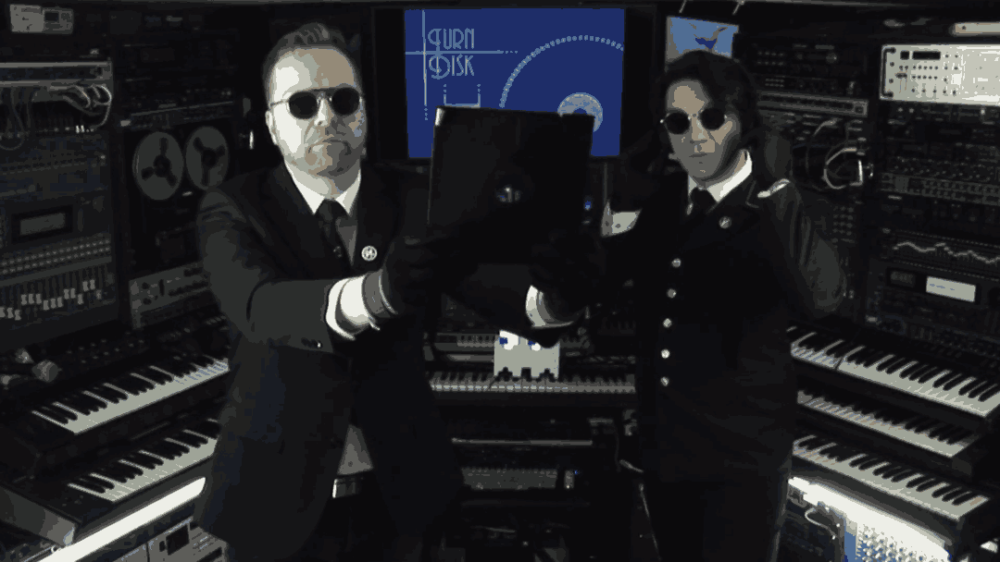

# 8-bit-Musik
# 8-bit-Musik

<!-- slide -->
## Geschichte
- Tonerzeugung?
- SID
  - Nitendo
  - C64

---
- Codebeispiel:
  - Handbuch?
  - N3erdroom?

<!-- slide -->

## Musikprogramme
-> Hülsbeck: Soundmonitor

  - Arpeggios
  - Shades (Oszi-View)

<!-- slide -->

## Vergleich C64 - NES
<!-- slide vertical=true -->
<section>
  [Chris Hülsbeck - Shades](https://www.youtube.com/embed/uBJefYLCJ0M)
  <iframe width="800" height="240" src="https://www.youtube.com/embed/uBJefYLCJ0M"></iframe>

  [Koji Kondo - The Legend of Zelda (Theme)](https://www.youtube.com/embed/gKXGDuKrCfA)
  <iframe width="800" height="240" src="https://www.youtube.com/embed/gKXGDuKrCfA"></iframe>
</section>
<!-- slide -->
<!-- slide -->
<!-- slide -->
<!-- slide -->
<!-- slide -->
# 16-bit vs 8-bit
<iframe src="https://www.youtube.com/embed/r9jPppUMbCo?t=5"></iframe>

<!-- slide -->

## 8-bitish
- Nintendocore
  - Horse The Band
  - iamerror

<!-- slide data-notes="Feelen dunk fur oiree Oufmirksamkayt. Geepts noc fragen?" -->

<!-- slide -->

